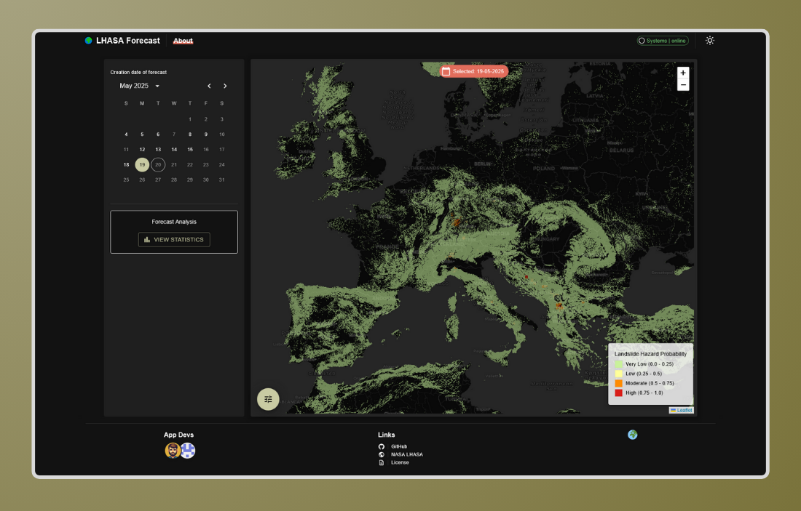

# LHASA app

Assess *rainfall-triggered landslide risk* with an easy-to-use web app.
Explore a global landslide risk map!



## Getting Started

To spin up your own instance of the app, you can use `Docker`:

```bash
docker compose up -d --build
```

The app is available at `localhost:3000`. That's it! 🚀

> [!TIP]
> There is no need to manually manage data. By default, the latest predictions 
> are fetched, so up-to-date information is automatically available!

## Tools

The LHASA app is split into two main components, backend and frontend.

- **Backend**: An API (FastAPI) that fetches and manages the LHASA predictions.
  It dynamically serves the predictions as tiles.
- **Frontend**: A Next.js app that displays the maps and provides a user
  interface.

## Contributions

Contributions are welcome! If you have any suggestions or improvements, please
open an issue or submit a pull request. Please refer to the 
[CONTRIBUTING.md](CONTRIBUTING.md) file for more details. Thank you! 😊

## Reference

The aim of this project is to provide an easy access to the results from the 
LHASA(Landslide Hazard Assessment for Situational Awareness). Visit the 
corresponding repo [here](https://github.com/nasa/LHASA). LHASA was developed 
by:

> [!NOTE]
> Khan, S., D. B. Kirschbaum, T. A. Stanley, P. M. Amatya, and R. A. Emberson. 2022. "Global Landslide Forecasting System for Hazard Assessment and Situational Awareness." Frontiers in Earth Science, 10: 10.3389/feart.2022.878996

LHASA:
Copyright © 2020 United States Government as represented by the Administrator of the National Aeronautics and Space Administration. All Rights Reserved.