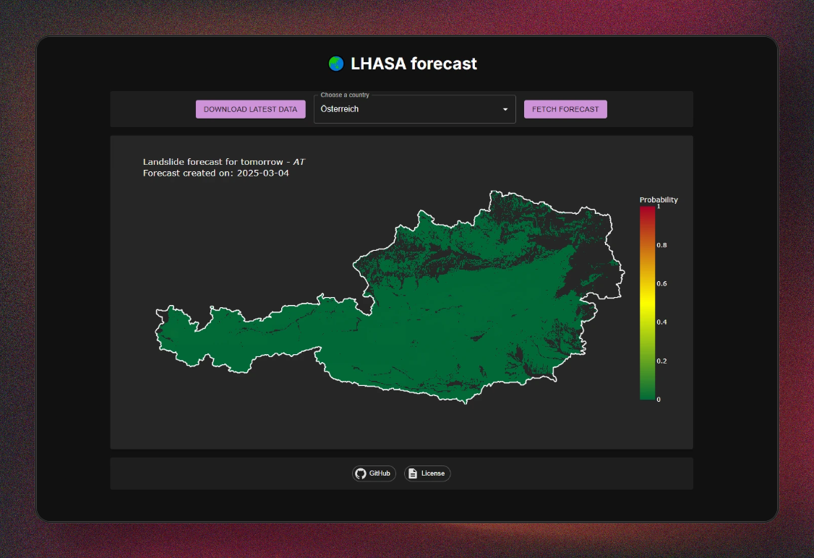

# LHASA app

Visualize the latest LHASA predictions.



## Development

Tech stack:

- FastAPI: To fetch the latest predictions and generate maps.
- Next.js: To visualize the maps.

To build and run the project, simply use:

```bash
docker compose up -d --build
```

## Background

The aim of this project is to simply visualize the results from the LHASA
(Landslide Hazard Assessment for Situational Awareness). Visit the corresponding
repo [here](https://github.com/nasa/LHASA).

> Khan, S., D. B. Kirschbaum, T. A. Stanley, P. M. Amatya, and R. A. Emberson. 2022. "Global Landslide Forecasting System for Hazard Assessment and Situational Awareness." Frontiers in Earth Science, 10: 10.3389/feart.2022.878996

LHASA:
Copyright © 2020 United States Government as represented by the Administrator of the National Aeronautics and Space Administration. All Rights Reserved.